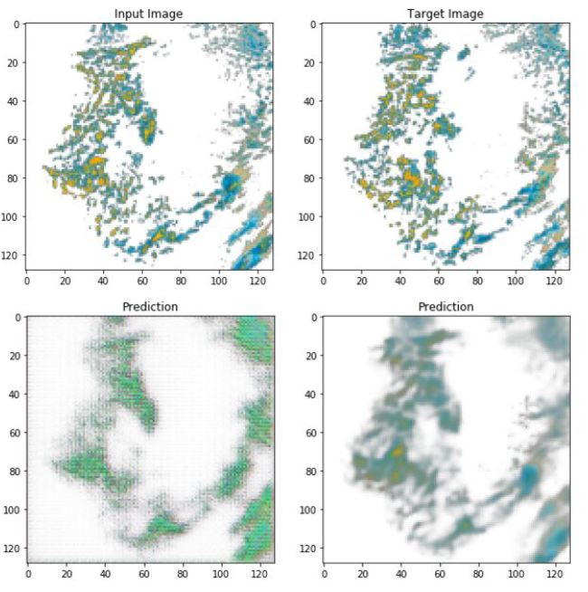

# UNET - Image Prediction - Predicting rain radar images

This project applies a U-Net convolutional
network architecture to meteorological precipitation
data to predict future precipitation radar imagery based
on current radar imagery. 

### Learning Progression

