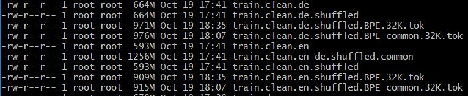

# HW09 - Distributed Training & Neural Machine Translation

Training a Transformer-based Machine Translation network on a small English to German WMT corpus.

## Answer questions

#### 1. How long does it take to complete the training run?
50000 steps takes approximately 22-23 hrs.

#### 2. Do you think your model is fully trained? How can you tell?
No. The BLUE score, Eval Loss and Learning rate have not levelled out yet. Some benefit from extra training would be expected.
BLUE Score

Eval Loss

#### 3. Were you overfitting?
At about step 48k it looks like the eval_loss started to increase. this could be an indication of overfitting.

#### 4. Were your GPUs fully utilized?
Yes. Both GPUs were utilized 100%.

v100a

v100b

#### 5. Did you monitor network traffic (hint: apt install nmon ) ? Was network the bottleneck?
The transmission is at 0.22 GB/s this I would expect means there is still spare capacity given the set up of 1GB network.
The Peak->Recv is at 14 GB/s for V100a. At first sight network does not look like a limiting factor. This seems to be supported by the fact that the peak Peak->Recv for v100b is app 0.24GB/s.

v100b

#### 6. Take a look at the plot of the learning rate and then check the config file. Can you explain this setting?
Config File

Learning Rate 

Warm up rate is set to 8000. If the data contains a correlated cluster the model's initial training can skew toward those features, to avoid this a warm up rate is set. This reduces the impact of the early training examples.

During training the learning rate will increase linearly from zero to the learning rate within the first warm up rate = 8,000 steps.

#### 7. How big was your training set (mb)? How many training lines did it contain?
915 MB

#### 8. What are the files that a TF checkpoint is comprised of?
Data, Index and Meta files

#### 9. How big is your resulting model checkpoint (mb)?
813 MB

#### 10. Remember the definition of a "step". How long did an average step take?
Time: approximately 1.6s

#### 11. How does that correlate with the observed network utilization between nodes?
813MB Model size - the model size is consistent for each checkpoint.

50000 steps 

23 hrs = 82800 seconds

82800 / 50000 = 1.656 Average step duration

220000 KB/s = 220 MB/s = 0.22 GB/s

This would mean that approximately 730 MB GB (2 nodes x 1.6 seconds x 0.22 GB/s) of data must have been transmitted after each step between the two nodes.
